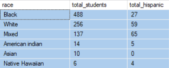
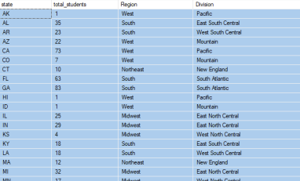
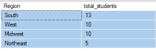
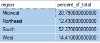
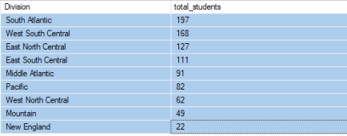
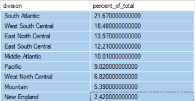
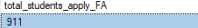

  

## Demographic Profile - Enrolled Students - (MS SQL Server)

## SQL Queries 

- [Time frame](/SQL/enrolled_analysis.sql)
- [Demographic Profile Queries](/SQL/enrolled_demo_profile.sql)

## Query Results  

### Basic Facts  

- The dataset includes 911 students enrolled at Campus, with 99% enrolling in 2024 and the remainder starting in 2025.

- Enrollment dates range from February 16, 2024, to February 11, 2025.

- The majority of students enrolled in August and September, while a smaller percentage applied earlier in the early and later in the fall/winter.

 
 

 

    

  

  

 
 
 

### Age

- Student ages range from 18 to 71 years old, with a median age of 29, indicating a diverse age group.

- The largest proportion of students falls within the 25-34 age range, aligning with early-to-mid career adults. 18-24-year-olds—representing traditional college-age students—form the second-largest group. Enrollment gradually declines across older age groups, with fewer students aged 45 and above.

 
 

 
 

### Gender 

- 68.17% of enrolled students are female (621 students), while 31.83% are male (290 students), indicating a female-majority enrollment

 

 
 

  

      

 
 

### Race

- There is a diversity of race amongst the enrolled students. 488 define themselves as Black, 256 as White, 137 as Mixed, 14 as American Indian, 10 as Asian, and 6 as Native Hawaiian.

- 160 students (17.6% of total enrollment) identify as Hispanic. Amongst them are 27 Black, 59 White, 65 Mixed, 5 American Indian, and 4 Native Hawaiian individuals, representing a mixed race population.

 
 

 

 

 

### Geography

- State Representation: Students represent 39 states, with the highest numbers from Texas (TX) and California (CA).

- City Distribution: Over 500 cities are represented, primarily from major metropolitan areas such as Houston, Chicago, Columbus, and the Bronx.

- Regional Breakdown:
    - South: More than 50% of enrolled students come from this region.
    - Midwest: The second-largest group of students.
    - West: Follows the Midwest in representation.
    - Northeast: The smallest regional group.

 
 

 

 

 
 

### Education

- High School Graduates:850 students hold a high school diploma, accounting for 93% of the total.

- GED Holders: 61 students have a GED qualification.

- College Experience: 441 students (48%) have previously enrolled in college.

 

### Veteran Status 

- Only 24, at 2% of students are veterans, 2 are in active duty. A few have family members related to military. The data shows that the majority of them have no veteran status.
 

 

###  Economic Status

- 100% applied for financial aid

