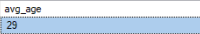
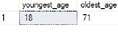

 

## Demographic Profile - Enrolled Students - (MS SQL Server)

### 🔹 SQL Queries 

- [Demographic Profile Queries](/SQL/enrolled_demo_profile.sql)

### 🔹  Results 

 - **Total Enrolled**

    

- **Median Age**

    

- **Age Range **

   

- **Race Breakdown**

