 

## Demographic Profile - Enrolled Students - (MS SQL Server)

## 🔹 SQL Queries 

- [Time frame](/SQL/enrolled_analysis.sql)
- [Demographic Profile Queries](/SQL/enrolled_demo_profile.sql)

## 🔹 Query Results  

 ### Timeframe of Enrollment 

- The dataset contains a total of 911 students enrolled in Campus and 99% enrolled during the year of 2024 with the remaining starting in 2025.

- The most recent date of enrollment was February 11, 2025  while the earliest was one year prior in February 16, 2024.

- The majority of students enrolled in August and September, while a smaller percentage applied earlier in the early and later in the fall/winter.

 

                    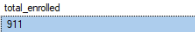   

                    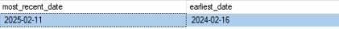

                    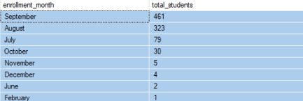

 

  ### Age

- The average age is 29 years old. 

 
 
     

     

     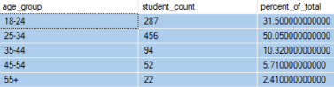

  ### Gender

- bullet points 

    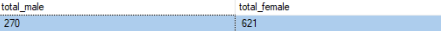 

    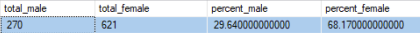
     
 
  ### Race

- bullet points

    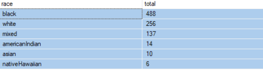

    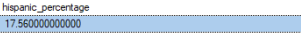

    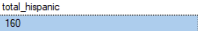

  ### Geography

- bullet points

- bullet points 

    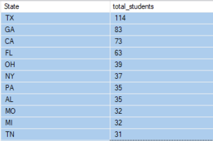

    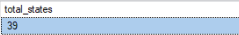

    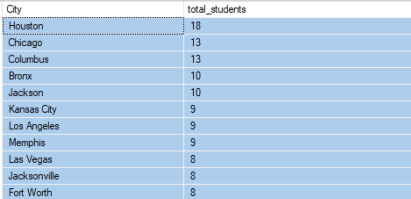

    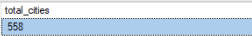

  ### Education

- bullet points

    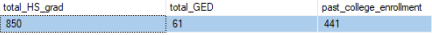

  ### Veteran Status

- bullet points

    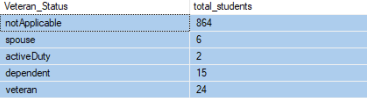

    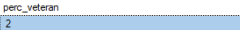

