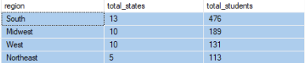

 

## Demographic Profile - Enrolled Students - (MS SQL Server)

## 🔹 SQL Queries 

- [Time frame](/SQL/enrolled_analysis.sql)
- [Demographic Profile Queries](/SQL/enrolled_demo_profile.sql)

## 🔹 Query Results  

 ### Timeframe of Enrollment 

- The dataset includes 911 students enrolled at Campus, with 99% enrolling in 2024 and the remainder starting in 2025.

- Enrollment dates range from February 16, 2024, to February 11, 2025.

- The majority of students enrolled in August and September, while a smaller percentage applied earlier in the early and later in the fall/winter.

 

       

    

    

 

  ### Age

- Student ages range from 18 to 71 years old, with a median age of 29, indicating a diverse age group.

- The largest proportion of students falls within the 25-34 age range, aligning with early-to-mid career adults. 18-24-year-olds—representing traditional college-age students—form the second-largest group. Enrollment gradually declines across older age groups, with fewer students aged 45 and above.

 
 
     

     

     

  ### Gender

- 68.17% of enrolled students are female (621 students), while 31.83% are male (290 students), indicating a female-majority enrollment

     

    
     
 
  ### Race

- There is a diversity of race amongst the enrolled students. 488 define themselves as Black, 256 as White, 137 as Mixed, 14 as American Indian, 10 as Asian, and 6 as Native Hawaiian.

- 160 students (17.6% of total enrollment) identify as Hispanic. Amongst them are 27 Black, 59 White, 65 Mixed, 5 American Indian, and 4 Native Hawaiian individuals, representing a mixed race population.

    

    

    

  ### Geography

- bullet points

- bullet points 

    

    

    

    

    

    

    

    

    

  ### Education

- bullet points

    

  ### Veteran Status

- bullet points

    

    

### Economic Status

    

