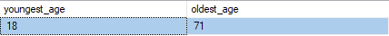

 

## Demographic Profile - Enrolled Students - (MS SQL Server)

### 🔹 SQL Queries 

- [Demographic Profile Queries](/SQL/enrolled_demo_profile.sql)

### 🔹  Results 

 - **911 Total Enrolled Students**

    

 - **Median Age = 29 Years**

    

 - **Age Range **

   

 - **Gender**

     

 
 - **Race**

    

- *Hispanic**

    

    

- **Geographics**

    

    

    

    

- **Education**

    

- **Veteran Status**

    

    

